# RNA_Structure_Analysis_Python
Analysis of RNA structure using python


[SHAPE_Analysis_Fixed.md](https://github.com/user-attachments/files/25741207/SHAPE_Analysis_Fixed.md)
---
output:
  html_document: default
  pdf_document: default
---

# SHAPE-MaP Deep Learning Analysis Pipeline

**Analysis of 497 RNA mutant oligos vs Wild-Type**

This notebook performs: 1. Data loading and preprocessing 2. Identification of mutations causing biggest SHAPE changes 3. Clustering to find groups with similar patterns 4. Deep learning for pattern discovery 5. Regional analysis of SHAPE reactivity

------------------------------------------------------------------------

## Part 1: Setup and Installation

**Note**: If you get version compatibility errors, skip the first cell and just run the imports cell

``` python
pip install numpy pandas matplotlib scikit-learn scipy umap-learn torch
```

```         
Requirement already satisfied: numpy in /opt/ohpc/pub/Software/anaconda3/envs/shape-analysis/lib/python3.10/site-packages (2.0.0)
Requirement already satisfied: pandas in /opt/ohpc/pub/Software/anaconda3/envs/shape-analysis/lib/python3.10/site-packages (2.2.2)
Requirement already satisfied: matplotlib in /opt/ohpc/pub/Software/anaconda3/envs/shape-analysis/lib/python3.10/site-packages (3.9.1)
Requirement already satisfied: scikit-learn in /opt/ohpc/pub/Software/anaconda3/envs/shape-analysis/lib/python3.10/site-packages (1.7.2)
Requirement already satisfied: scipy in /opt/ohpc/pub/Software/anaconda3/envs/shape-analysis/lib/python3.10/site-packages (1.14.0)
Requirement already satisfied: umap-learn in /opt/ohpc/pub/Software/anaconda3/envs/shape-analysis/lib/python3.10/site-packages (0.5.11)
Requirement already satisfied: torch in /opt/ohpc/pub/Software/anaconda3/envs/shape-analysis/lib/python3.10/site-packages (2.10.0)
Requirement already satisfied: python-dateutil>=2.8.2 in /opt/ohpc/pub/Software/anaconda3/envs/shape-analysis/lib/python3.10/site-packages (from pandas) (2.9.0.post0)
Requirement already satisfied: pytz>=2020.1 in /opt/ohpc/pub/Software/anaconda3/envs/shape-analysis/lib/python3.10/site-packages (from pandas) (2025.2)
Requirement already satisfied: tzdata>=2022.7 in /opt/ohpc/pub/Software/anaconda3/envs/shape-analysis/lib/python3.10/site-packages (from pandas) (2025.3)
Requirement already satisfied: contourpy>=1.0.1 in /opt/ohpc/pub/Software/anaconda3/envs/shape-analysis/lib/python3.10/site-packages (from matplotlib) (1.2.1)
Requirement already satisfied: cycler>=0.10 in /opt/ohpc/pub/Software/anaconda3/envs/shape-analysis/lib/python3.10/site-packages (from matplotlib) (0.12.1)
Requirement already satisfied: fonttools>=4.22.0 in /opt/ohpc/pub/Software/anaconda3/envs/shape-analysis/lib/python3.10/site-packages (from matplotlib) (4.53.0)
Requirement already satisfied: kiwisolver>=1.3.1 in /opt/ohpc/pub/Software/anaconda3/envs/shape-analysis/lib/python3.10/site-packages (from matplotlib) (1.4.5)
Requirement already satisfied: packaging>=20.0 in /opt/ohpc/pub/Software/anaconda3/envs/shape-analysis/lib/python3.10/site-packages (from matplotlib) (26.0)
Requirement already satisfied: pillow>=8 in /opt/ohpc/pub/Software/anaconda3/envs/shape-analysis/lib/python3.10/site-packages (from matplotlib) (9.4.0)
Requirement already satisfied: pyparsing>=2.3.1 in /opt/ohpc/pub/Software/anaconda3/envs/shape-analysis/lib/python3.10/site-packages (from matplotlib) (3.3.2)
Requirement already satisfied: joblib>=1.2.0 in /opt/ohpc/pub/Software/anaconda3/envs/shape-analysis/lib/python3.10/site-packages (from scikit-learn) (1.5.3)
Requirement already satisfied: threadpoolctl>=3.1.0 in /opt/ohpc/pub/Software/anaconda3/envs/shape-analysis/lib/python3.10/site-packages (from scikit-learn) (3.6.0)
Requirement already satisfied: numba>=0.51.2 in /opt/ohpc/pub/Software/anaconda3/envs/shape-analysis/lib/python3.10/site-packages (from umap-learn) (0.64.0)
Requirement already satisfied: pynndescent>=0.5 in /opt/ohpc/pub/Software/anaconda3/envs/shape-analysis/lib/python3.10/site-packages (from umap-learn) (0.6.0)
Requirement already satisfied: tqdm in /opt/ohpc/pub/Software/anaconda3/envs/shape-analysis/lib/python3.10/site-packages (from umap-learn) (4.67.3)
Requirement already satisfied: filelock in /opt/ohpc/pub/Software/anaconda3/envs/shape-analysis/lib/python3.10/site-packages (from torch) (3.25.0)
Requirement already satisfied: typing-extensions>=4.10.0 in /opt/ohpc/pub/Software/anaconda3/envs/shape-analysis/lib/python3.10/site-packages (from torch) (4.15.0)
Requirement already satisfied: sympy>=1.13.3 in /opt/ohpc/pub/Software/anaconda3/envs/shape-analysis/lib/python3.10/site-packages (from torch) (1.14.0)
Requirement already satisfied: networkx>=2.5.1 in /opt/ohpc/pub/Software/anaconda3/envs/shape-analysis/lib/python3.10/site-packages (from torch) (3.4.2)
Requirement already satisfied: jinja2 in /opt/ohpc/pub/Software/anaconda3/envs/shape-analysis/lib/python3.10/site-packages (from torch) (3.1.6)
Requirement already satisfied: fsspec>=0.8.5 in /opt/ohpc/pub/Software/anaconda3/envs/shape-analysis/lib/python3.10/site-packages (from torch) (2026.2.0)
Requirement already satisfied: cuda-bindings==12.9.4 in /opt/ohpc/pub/Software/anaconda3/envs/shape-analysis/lib/python3.10/site-packages (from torch) (12.9.4)
Requirement already satisfied: nvidia-cuda-nvrtc-cu12==12.8.93 in /opt/ohpc/pub/Software/anaconda3/envs/shape-analysis/lib/python3.10/site-packages (from torch) (12.8.93)
Requirement already satisfied: nvidia-cuda-runtime-cu12==12.8.90 in /opt/ohpc/pub/Software/anaconda3/envs/shape-analysis/lib/python3.10/site-packages (from torch) (12.8.90)
Requirement already satisfied: nvidia-cuda-cupti-cu12==12.8.90 in /opt/ohpc/pub/Software/anaconda3/envs/shape-analysis/lib/python3.10/site-packages (from torch) (12.8.90)
Requirement already satisfied: nvidia-cudnn-cu12==9.10.2.21 in /opt/ohpc/pub/Software/anaconda3/envs/shape-analysis/lib/python3.10/site-packages (from torch) (9.10.2.21)
Requirement already satisfied: nvidia-cublas-cu12==12.8.4.1 in /opt/ohpc/pub/Software/anaconda3/envs/shape-analysis/lib/python3.10/site-packages (from torch) (12.8.4.1)
Requirement already satisfied: nvidia-cufft-cu12==11.3.3.83 in /opt/ohpc/pub/Software/anaconda3/envs/shape-analysis/lib/python3.10/site-packages (from torch) (11.3.3.83)
Requirement already satisfied: nvidia-curand-cu12==10.3.9.90 in /opt/ohpc/pub/Software/anaconda3/envs/shape-analysis/lib/python3.10/site-packages (from torch) (10.3.9.90)
Requirement already satisfied: nvidia-cusolver-cu12==11.7.3.90 in /opt/ohpc/pub/Software/anaconda3/envs/shape-analysis/lib/python3.10/site-packages (from torch) (11.7.3.90)
Requirement already satisfied: nvidia-cusparse-cu12==12.5.8.93 in /opt/ohpc/pub/Software/anaconda3/envs/shape-analysis/lib/python3.10/site-packages (from torch) (12.5.8.93)
Requirement already satisfied: nvidia-cusparselt-cu12==0.7.1 in /opt/ohpc/pub/Software/anaconda3/envs/shape-analysis/lib/python3.10/site-packages (from torch) (0.7.1)
Requirement already satisfied: nvidia-nccl-cu12==2.27.5 in /opt/ohpc/pub/Software/anaconda3/envs/shape-analysis/lib/python3.10/site-packages (from torch) (2.27.5)
Requirement already satisfied: nvidia-nvshmem-cu12==3.4.5 in /opt/ohpc/pub/Software/anaconda3/envs/shape-analysis/lib/python3.10/site-packages (from torch) (3.4.5)
Requirement already satisfied: nvidia-nvtx-cu12==12.8.90 in /opt/ohpc/pub/Software/anaconda3/envs/shape-analysis/lib/python3.10/site-packages (from torch) (12.8.90)
Requirement already satisfied: nvidia-nvjitlink-cu12==12.8.93 in /opt/ohpc/pub/Software/anaconda3/envs/shape-analysis/lib/python3.10/site-packages (from torch) (12.8.93)
Requirement already satisfied: nvidia-cufile-cu12==1.13.1.3 in /opt/ohpc/pub/Software/anaconda3/envs/shape-analysis/lib/python3.10/site-packages (from torch) (1.13.1.3)
Requirement already satisfied: triton==3.6.0 in /opt/ohpc/pub/Software/anaconda3/envs/shape-analysis/lib/python3.10/site-packages (from torch) (3.6.0)
Requirement already satisfied: cuda-pathfinder~=1.1 in /opt/ohpc/pub/Software/anaconda3/envs/shape-analysis/lib/python3.10/site-packages (from cuda-bindings==12.9.4->torch) (1.4.0)
Requirement already satisfied: llvmlite<0.47,>=0.46.0dev0 in /opt/ohpc/pub/Software/anaconda3/envs/shape-analysis/lib/python3.10/site-packages (from numba>=0.51.2->umap-learn) (0.46.0)
Requirement already satisfied: six>=1.5 in /opt/ohpc/pub/Software/anaconda3/envs/shape-analysis/lib/python3.10/site-packages (from python-dateutil>=2.8.2->pandas) (1.17.0)
Requirement already satisfied: mpmath<1.4,>=1.1.0 in /opt/ohpc/pub/Software/anaconda3/envs/shape-analysis/lib/python3.10/site-packages (from sympy>=1.13.3->torch) (1.3.0)
Requirement already satisfied: MarkupSafe>=2.0 in /opt/ohpc/pub/Software/anaconda3/envs/shape-analysis/lib/python3.10/site-packages (from jinja2->torch) (2.1.5)
Note: you may need to restart the kernel to use updated packages.
```

``` python
# Import libraries
import numpy as np
import pandas as pd
import matplotlib.pyplot as plt
import warnings
warnings.filterwarnings('ignore')

# Try to import seaborn, but it's optional
try:
    import seaborn as sns
    sns.set_palette("husl")
    HAS_SEABORN = True
    print("✓ Seaborn loaded")
except (ImportError, AttributeError) as e:
    print("Note: Seaborn not available (will use matplotlib only)")
    HAS_SEABORN = False

from sklearn.preprocessing import StandardScaler
from sklearn.decomposition import PCA
from sklearn.cluster import KMeans, AgglomerativeClustering, DBSCAN
from sklearn.manifold import TSNE
from scipy.cluster.hierarchy import dendrogram, linkage
from scipy.spatial.distance import pdist, squareform
from scipy.stats import pearsonr, spearmanr

# Try UMAP
import umap.umap_ as umap

# Deep learning
import torch
import torch.nn as nn
import torch.nn.functional as F
from torch.utils.data import Dataset, DataLoader

# Set style
plt.style.use('default')

# Set random seeds
np.random.seed(42)
torch.manual_seed(42)

print("\n✓ All core packages imported successfully!")
print(f"PyTorch version: {torch.__version__}")
print(f"Device: {'GPU' if torch.cuda.is_available() else 'CPU'}")
```

```         
✓ Seaborn loaded

✓ All core packages imported successfully!
PyTorch version: 2.10.0+cu128
Device: GPU
```

## Part 2: Load and Process Data

``` python
# Load data
data_path = 'data/data.txt'  # Update this path if needed

print("Loading SHAPE data...")
df = pd.read_csv(data_path, sep='\t')

print(f"\n✓ Loaded {len(df):,} rows")
print(f"✓ Columns: {len(df.columns)}")
print(f"\nFirst few rows:")
df.head()
```

```         
Loading SHAPE data...

✓ Loaded 84,490 rows
✓ Columns: 38

First few rows:
```

<div>

```{=html}
<style scoped>
    .dataframe tbody tr th:only-of-type {
        vertical-align: middle;
    }

    .dataframe tbody tr th {
        vertical-align: top;
    }

    .dataframe thead th {
        text-align: right;
    }
</style>
```

</div>

``` python
# Data summary
n_samples = df['sample'].nunique()
n_positions = df['Nucleotide'].nunique()
n_annots = df['annot'].nunique()

print(f"Dataset Summary:")
print(f"  Unique samples: {n_samples}")
print(f"  Nucleotide positions: {n_positions}")
print(f"  Unique annotations: {n_annots}")
print(f"\nTop 20 annotation categories:")
print(df['annot'].value_counts().head(20))
```

```         
Dataset Summary:
  Unique samples: 497
  Nucleotide positions: 170
  Unique annotations: 156

Top 20 annotation categories:
annot
Branch_Point                 7820
NAGNAG                       5100
C3SS_2_TGF_C3SS              3740
Can_2_TGF_Can                2380
Weaken_C3SS_Py               2040
Weaken_Can_Py                2040
Dinuc_Shuffle                1700
Move_C3SS                    1700
RBP_Block_Four               1360
RBP_Block_Three              1360
RBP_Block_One                1360
Strengthen_C3SS_Py           1360
RBP_Block_Two                1360
C3SS_KO                      1360
Strengthen_Can_Py            1020
Can_KO                       1020
Swap_C3SS_2_Can               680
RBP_Two_RBP_four_au_rich      340
RBP_Two_RBP_four_shuffle      340
RBP_Two_RBP_three_au_rich     340
Name: count, dtype: int64
```

``` python
# Reshape data to matrix format
# Rows = samples, Columns = positions

print("Reshaping data to matrix format...")
shape_matrix_df = df.pivot(index='sample', columns='Nucleotide', values='Norm_profile')

shape_matrix = shape_matrix_df.values
samples = shape_matrix_df.index.tolist()
positions = shape_matrix_df.columns.tolist()

print(f"\n✓ Matrix shape: {shape_matrix.shape}")
print(f"  (Samples: {len(samples)}, Positions: {len(positions)})")

# Check for missing values
n_missing = np.isnan(shape_matrix).sum()
if n_missing > 0:
    print(f"\n⚠ Warning: {n_missing} missing values detected ({100*n_missing/shape_matrix.size:.2f}%)")
    print("  Imputing with median values...")
    from sklearn.impute import SimpleImputer
    imputer = SimpleImputer(strategy='median')
    shape_matrix = imputer.fit_transform(shape_matrix)
    print("  ✓ Imputation complete")
else:
    print("\n✓ No missing values")
```

```         
Reshaping data to matrix format...

✓ Matrix shape: (497, 170)
  (Samples: 497, Positions: 170)

⚠ Warning: 5572 missing values detected (6.59%)
  Imputing with median values...
  ✓ Imputation complete
```

``` python
# Extract annotation information for each sample
print("Extracting annotations...")
annotations = df.groupby('sample')['annot'].first().to_dict()

print(f"\n✓ Extracted annotations for {len(annotations)} samples")
print(f"\nTop 10 annotation categories:")
annot_counts = pd.Series(list(annotations.values())).value_counts()
print(annot_counts.head(10))
```

```         
Extracting annotations...

✓ Extracted annotations for 497 samples

Top 10 annotation categories:
Branch_Point       46
NAGNAG             30
C3SS_2_TGF_C3SS    22
Can_2_TGF_Can      14
Weaken_C3SS_Py     12
Weaken_Can_Py      12
Dinuc_Shuffle      10
Move_C3SS          10
RBP_Block_Four      8
RBP_Block_Three     8
Name: count, dtype: int64
```

## Part 3: Wild-Type Analysis

``` python
# Identify wild-type samples
wt_samples = ['One_205', 'Two_205']

print("Looking for wild-type samples...")
wt_indices = [i for i, s in enumerate(samples) if s in wt_samples]

if len(wt_indices) == 0:
    print("\n⚠ Warning: Wild-type samples not found!")
    print("   Searching for samples containing '205'...")
    wt_indices = [i for i, s in enumerate(samples) if '205' in s]
    wt_samples = [samples[i] for i in wt_indices]

print(f"\n✓ Found {len(wt_indices)} wild-type samples:")
for idx in wt_indices:
    print(f"  - {samples[idx]}")

# Compute average WT profile
wt_profile = np.mean(shape_matrix[wt_indices, :], axis=0)
print(f"\n✓ Computed average WT profile")
```

```         
Looking for wild-type samples...

✓ Found 1 wild-type samples:
  - Two_205

✓ Computed average WT profile
```

``` python
# Plot wild-type profile
fig, ax = plt.subplots(figsize=(14, 4))

ax.plot(positions, wt_profile, 'k-', linewidth=1.5, label='WT Average')

# Plot individual WT replicates
for idx in wt_indices:
    ax.plot(positions, shape_matrix[idx, :], alpha=0.3, linewidth=0.8, 
            label=samples[idx])

ax.set_xlabel('Nucleotide Position', fontsize=12)
ax.set_ylabel('SHAPE Reactivity (Norm)', fontsize=12)
ax.set_title('Wild-Type SHAPE Profile', fontsize=14, fontweight='bold')
ax.legend()
ax.grid(alpha=0.3)
plt.tight_layout()
plt.show()

print(f"WT profile statistics:")
print(f"  Mean reactivity: {wt_profile.mean():.4f}")
print(f"  Std deviation: {wt_profile.std():.4f}")
print(f"  Min: {wt_profile.min():.4f}")
print(f"  Max: {wt_profile.max():.4f}")
```

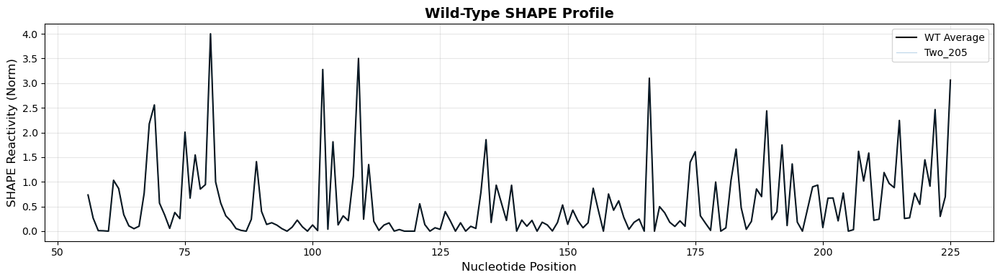

```         
WT profile statistics:
  Mean reactivity: 0.5759
  Std deviation: 0.7531
  Min: 0.0000
  Max: 4.0000
```

## Part 4: Compute Differences from Wild-Type

``` python
# Compute difference matrix (each sample - WT)
print("Computing differences from wild-type...")
diff_matrix = shape_matrix - wt_profile[np.newaxis, :]

# Compute distance metrics
mean_abs_diff = np.abs(diff_matrix).mean(axis=1)
max_abs_diff = np.abs(diff_matrix).max(axis=1)
rmsd = np.sqrt(np.mean(diff_matrix**2, axis=1))

print(f"\n✓ Computed difference profiles")
print(f"\nDistance metrics summary:")
print(f"  Mean |diff|: {mean_abs_diff.mean():.4f} ± {mean_abs_diff.std():.4f}")
print(f"  Max |diff|:  {max_abs_diff.mean():.4f} ± {max_abs_diff.std():.4f}")
print(f"  RMSD:        {rmsd.mean():.4f} ± {rmsd.std():.4f}")
```

```         
Computing differences from wild-type...

✓ Computed difference profiles

Distance metrics summary:
  Mean |diff|: 0.3313 ± 0.0962
  Max |diff|:  2.9500 ± 0.6784
  RMSD:        0.5647 ± 0.1418
```

``` python
# Create results dataframe
results_df = pd.DataFrame({
    'sample': samples,
    'annotation': [annotations.get(s, 'Unknown') for s in samples],
    'mean_abs_diff': mean_abs_diff,
    'max_abs_diff': max_abs_diff,
    'rmsd': rmsd,
    'is_wt': [s in wt_samples for s in samples]
})

# Sort by RMSD
results_df = results_df.sort_values('rmsd', ascending=False)

print("\nTop 20 most different samples from WT (by RMSD):")
print(results_df.head(20)[['sample', 'annotation', 'rmsd']])
```

```         
Top 20 most different samples from WT (by RMSD):
      sample        annotation      rmsd
174   One_32      DHDDS_Intron  1.075326
423   Two_32      DHDDS_Intron  1.034805
392  Two_229     Dinuc_Shuffle  0.985664
427   Two_36       ODF2_Intron  0.982926
422   Two_31      GAPDH_Intron  0.981903
173   One_31      GAPDH_Intron  0.980170
143  One_229     Dinuc_Shuffle  0.962495
424   Two_33     EIF4G1_Intron  0.959370
274  Two_122  AT_to_GC_50pct_4  0.957549
418   Two_28         Move_C3SS  0.956750
24   One_120  AT_to_GC_50pct_2  0.955811
175   One_33     EIF4G1_Intron  0.954380
395  Two_231     Dinuc_Shuffle  0.944926
428   Two_37      TRNT1_Intron  0.938344
272  Two_120  AT_to_GC_50pct_2  0.936696
146  One_231     Dinuc_Shuffle  0.926742
179   One_37      TRNT1_Intron  0.918042
178   One_36       ODF2_Intron  0.914845
419   Two_29      AP5Z1_Intron  0.914165
172   One_30     ARMCX3_Intron  0.905727
```

## Part 5: Visualize Top Different Mutants

``` python
# Plot top 20 most different samples
top_n = 20
top_indices = np.argsort(rmsd)[::-1][:top_n]

fig, axes = plt.subplots(4, 5, figsize=(20, 12), sharex=True, sharey=True)
axes = axes.flatten()

for idx, (sample_idx, ax) in enumerate(zip(top_indices, axes)):
    sample_name = samples[sample_idx]
    annot = annotations.get(sample_name, 'Unknown')
    
    # Plot WT and mutant profiles
    ax.plot(positions, wt_profile, 'k-', alpha=0.5, linewidth=1, label='WT')
    ax.plot(positions, shape_matrix[sample_idx, :], 'r-', 
            linewidth=1.5, label=sample_name)
    
    # Add title with info
    title = f"{sample_name}\n{annot}\nRMSD={rmsd[sample_idx]:.3f}"
    ax.set_title(title, fontsize=8)
    ax.grid(alpha=0.3)
    
    if idx == 0:
        ax.legend(fontsize=6)

fig.suptitle('Top 20 Mutants with Biggest SHAPE Changes vs WT', 
             fontsize=16, fontweight='bold', y=1.00)
fig.text(0.5, 0.02, 'Nucleotide Position', ha='center', fontsize=12)
fig.text(0.02, 0.5, 'SHAPE Reactivity', va='center', rotation='vertical', fontsize=12)
plt.tight_layout()
plt.show()
```

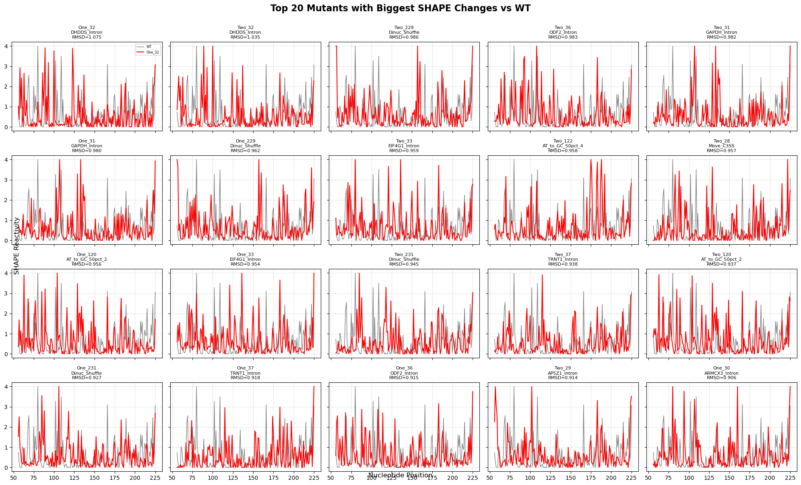

``` python
# Heatmap of difference profiles for top 50 samples
top_n = 50
top_indices = np.argsort(rmsd)[::-1][:top_n]

diff_data = diff_matrix[top_indices, :]
sample_labels = [f"{samples[i]} ({annotations.get(samples[i], 'Unknown')})" 
                 for i in top_indices]

fig, ax = plt.subplots(figsize=(14, 12))
im = ax.imshow(diff_data, aspect='auto', cmap='RdBu_r', vmin=-1, vmax=1)

ax.set_yticks(range(len(sample_labels)))
ax.set_yticklabels(sample_labels, fontsize=6)
ax.set_xlabel('Nucleotide Position', fontsize=12)
ax.set_ylabel('Sample (Annotation)', fontsize=12)
ax.set_title(f'SHAPE Difference from WT\n(Top {top_n} Most Different Samples)', 
            fontsize=14, fontweight='bold')

cbar = plt.colorbar(im, ax=ax)
cbar.set_label('ΔReactivity (Mutant - WT)', fontsize=11)
plt.tight_layout()
plt.show()
```

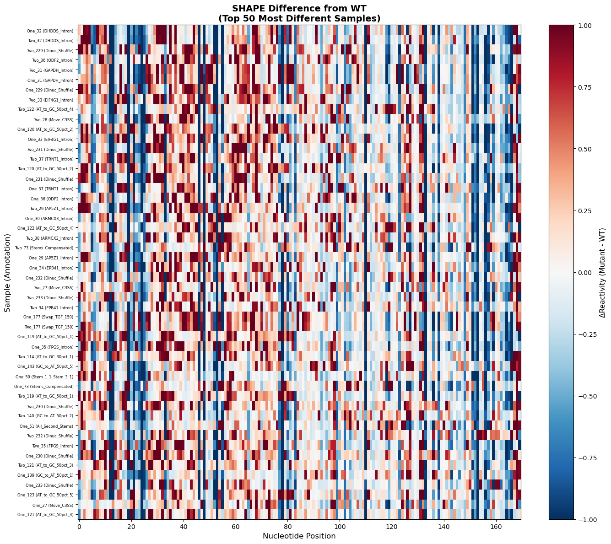

## Part 6: Distribution Analysis by Annotation

``` python
# Analyze RMSD by annotation category
annot_stats = results_df.groupby('annotation')['rmsd'].agg(['mean', 'std', 'count'])
annot_stats = annot_stats.sort_values('mean', ascending=False)

print("\nTop 20 annotations by mean RMSD from WT:")
print(annot_stats.head(20))
```

```         
Top 20 annotations by mean RMSD from WT:
                       mean       std  count
annotation                                  
DHDDS_Intron       1.055065  0.028653      2
GAPDH_Intron       0.981036  0.001225      2
EIF4G1_Intron      0.956875  0.003529      2
ODF2_Intron        0.948885  0.048140      2
AT_to_GC_50pct_2   0.946254  0.013516      2
AT_to_GC_50pct_4   0.930946  0.037623      2
TRNT1_Intron       0.928193  0.014356      2
AP5Z1_Intron       0.905897  0.011692      2
ARMCX3_Intron      0.902944  0.003937      2
EPB41_Intron       0.884772  0.014686      2
Dinuc_Shuffle      0.876610  0.076078     10
Swap_TGF_150       0.865927  0.007551      2
Stems_Compensated  0.864326  0.049639      2
AT_to_GC_50pct_1   0.833878  0.031297      2
FPGS_Intron        0.825203  0.039088      2
AT_to_GC_30pct_1   0.809314  0.056620      2
AT_to_GC_50pct_3   0.787766  0.012298      2
GC_to_AT_50pct_5   0.779606  0.091485      2
AT_to_GC_50pct_5   0.763315  0.031180      2
Stem_1_1_Stem_3_1  0.745308  0.139172      2
```

``` python
# Box plot of RMSD by top annotation categories
top_annots = annot_stats.head(15).index.tolist()
plot_data = results_df[results_df['annotation'].isin(top_annots)]

fig, ax = plt.subplots(figsize=(14, 6))

# Manual boxplot using matplotlib
positions_box = []
data_box = []
for i, annot in enumerate(top_annots):
    annot_data = plot_data[plot_data['annotation'] == annot]['rmsd'].values
    if len(annot_data) > 0:
        positions_box.append(i)
        data_box.append(annot_data)

bp = ax.boxplot(data_box, positions=positions_box, widths=0.6, patch_artist=True)

# Color boxes
for patch in bp['boxes']:
    patch.set_facecolor('lightblue')
    patch.set_alpha(0.7)

ax.set_xticks(positions_box)
ax.set_xticklabels(top_annots, rotation=45, ha='right', fontsize=9)
ax.set_ylabel('RMSD from WT', fontsize=12)
ax.set_xlabel('Annotation Category', fontsize=12)
ax.set_title('SHAPE Difference Distribution by Annotation\n(Top 15 Categories)', 
            fontsize=14, fontweight='bold')
ax.grid(axis='y', alpha=0.3)
plt.tight_layout()
plt.show()
```

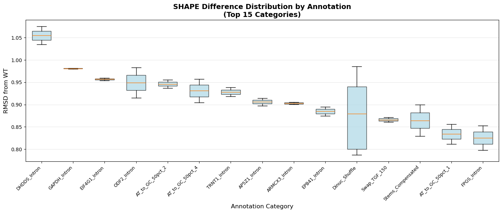

## Part 7: Regional Analysis - Find Hotspots

``` python
# Sliding window analysis to find regional hotspots
window_size = 10
n_samples, n_positions_mat = diff_matrix.shape
n_windows = n_positions_mat - window_size + 1

print(f"Performing sliding window analysis...")
print(f"  Window size: {window_size} nucleotides")
print(f"  Number of windows: {n_windows}")

# Compute windowed RMSD
windowed_rmsd = np.zeros((n_samples, n_windows))

for i in range(n_windows):
    window_diff = diff_matrix[:, i:i+window_size]
    windowed_rmsd[:, i] = np.sqrt(np.mean(window_diff**2, axis=1))

# Find regions with highest variability across samples
window_variance = np.var(windowed_rmsd, axis=0)
window_mean_rmsd = np.mean(windowed_rmsd, axis=0)

print(f"\n✓ Windowed analysis complete")
```

```         
Performing sliding window analysis...
  Window size: 10 nucleotides
  Number of windows: 161

✓ Windowed analysis complete
```

``` python
# Plot regional variability
top_regions = np.argsort(window_variance)[::-1][:5]

fig, axes = plt.subplots(3, 1, figsize=(14, 10))

# Plot 1: Mean RMSD across positions
ax = axes[0]
ax.plot(window_mean_rmsd, 'b-', linewidth=1.5)
for region in top_regions:
    ax.axvline(region, color='r', alpha=0.3, linestyle='--', linewidth=1)
ax.set_ylabel('Mean RMSD', fontsize=11)
ax.set_title('Regional Mean SHAPE Difference (10nt windows)', fontsize=12, fontweight='bold')
ax.grid(alpha=0.3)

# Plot 2: Variance across positions
ax = axes[1]
ax.plot(window_variance, 'g-', linewidth=1.5)
for region in top_regions:
    ax.axvline(region, color='r', alpha=0.3, linestyle='--', linewidth=1)
    ax.text(region, window_variance[region], f'{region}', 
           fontsize=8, rotation=90, va='bottom')
ax.set_ylabel('Variance in RMSD', fontsize=11)
ax.set_title('Regional Variability Across Samples (High variance = hotspot)', 
            fontsize=12, fontweight='bold')
ax.grid(alpha=0.3)

# Plot 3: Heatmap of most variable region
ax = axes[2]
top_region = top_regions[0]
region_start = max(0, top_region - 20)
region_end = min(n_windows, top_region + 20)
region_data = windowed_rmsd[:50, region_start:region_end]  # Top 50 samples

im = ax.imshow(region_data, aspect='auto', cmap='viridis')
ax.set_ylabel('Sample (top 50)', fontsize=11)
ax.set_xlabel('Window position relative to peak', fontsize=11)
ax.set_title(f'RMSD Heatmap Around Most Variable Region (Window {top_region})', 
            fontsize=12, fontweight='bold')
plt.colorbar(im, ax=ax, label='Windowed RMSD')

plt.tight_layout()
plt.show()

print(f"\nTop 5 most variable regions (window start positions):")
for i, region in enumerate(top_regions, 1):
    print(f"  {i}. Position {region}-{region+window_size} (variance={window_variance[region]:.4f})")
```

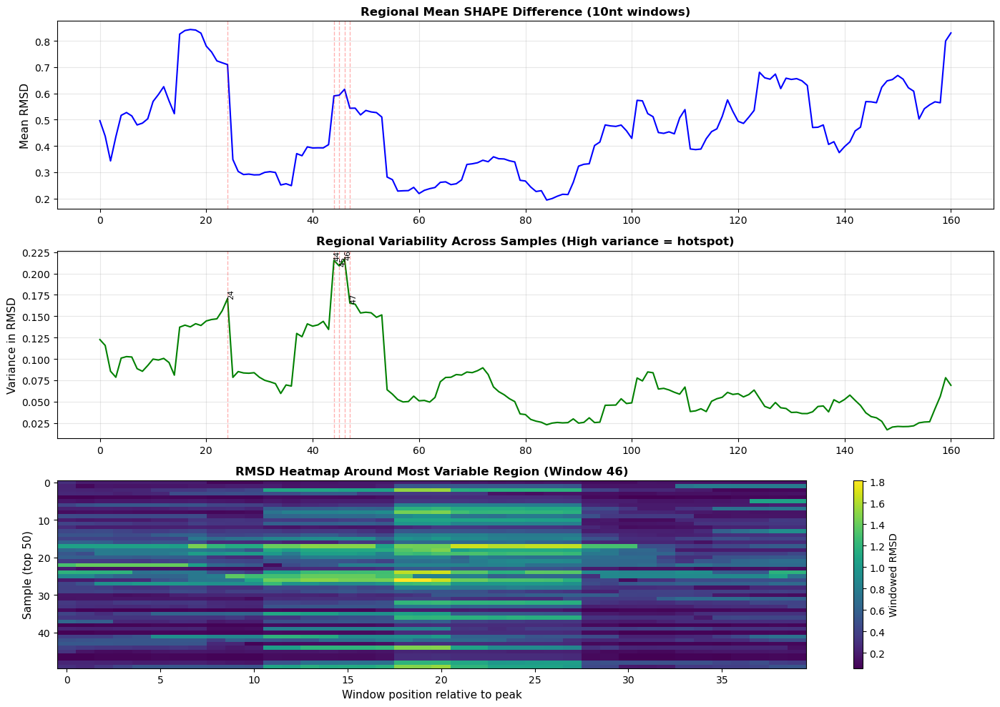

```         
Top 5 most variable regions (window start positions):
  1. Position 46-56 (variance=0.2166)
  2. Position 44-54 (variance=0.2154)
  3. Position 45-55 (variance=0.2089)
  4. Position 24-34 (variance=0.1707)
  5. Position 47-57 (variance=0.1653)
```

## Part 8: Unsupervised Clustering

``` python
# Dimensionality reduction with PCA
print("Performing PCA...")
pca = PCA(n_components=50)
X_pca = pca.fit_transform(diff_matrix)

print(f"\n✓ PCA complete")
print(f"  Variance explained by first 10 PCs: {pca.explained_variance_ratio_[:10].sum():.3f}")

# Plot variance explained
fig, ax = plt.subplots(figsize=(10, 4))
ax.plot(np.cumsum(pca.explained_variance_ratio_), 'b-o', linewidth=2, markersize=4)
ax.axhline(0.9, color='r', linestyle='--', alpha=0.5, label='90% variance')
ax.set_xlabel('Number of Components', fontsize=11)
ax.set_ylabel('Cumulative Variance Explained', fontsize=11)
ax.set_title('PCA Variance Explained', fontsize=13, fontweight='bold')
ax.legend()
ax.grid(alpha=0.3)
plt.tight_layout()
plt.show()
```

```         
Performing PCA...

✓ PCA complete
  Variance explained by first 10 PCs: 0.461
```

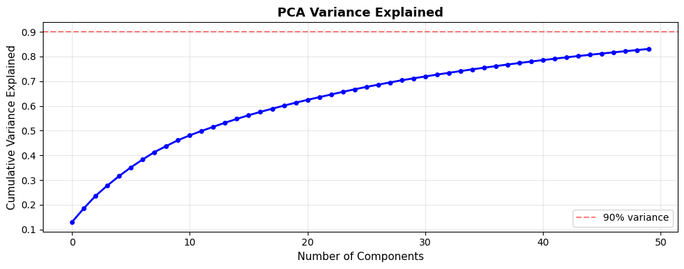

``` python
# Dimensionality reduction for visualization
print("Computing 2D embedding for visualization...")

print("  Using UMAP...")
reducer = umap.UMAP(n_neighbors=15, min_dist=0.1, random_state=42, n_components=2)
embedding = reducer.fit_transform(diff_matrix)
embedding_method = "UMAP"

print("  Using t-SNE (this may take a minute)...")
tsne = TSNE(n_components=2, random_state=42, perplexity=30)
embedding = tsne.fit_transform(diff_matrix)
embedding_method = "t-SNE"

print(f"✓ {embedding_method} complete")
```

```         
Computing 2D embedding for visualization...
  Using UMAP...
  Using t-SNE (this may take a minute)...
✓ t-SNE complete
```

``` python
# K-means clustering
n_clusters = 8
print(f"\nPerforming K-means clustering with {n_clusters} clusters...")

kmeans = KMeans(n_clusters=n_clusters, random_state=42, n_init=20)
cluster_labels = kmeans.fit_predict(diff_matrix)

# Print cluster sizes
unique, counts = np.unique(cluster_labels, return_counts=True)
print(f"\n✓ Clustering complete")
print("\nCluster sizes:")
for cluster_id, count in zip(unique, counts):
    print(f"  Cluster {cluster_id}: {count} samples")
```

```         
Performing K-means clustering with 8 clusters...

✓ Clustering complete

Cluster sizes:
  Cluster 0: 49 samples
  Cluster 1: 94 samples
  Cluster 2: 74 samples
  Cluster 3: 50 samples
  Cluster 4: 45 samples
  Cluster 5: 60 samples
  Cluster 6: 95 samples
  Cluster 7: 30 samples
```

``` python
# Visualize clusters
fig, axes = plt.subplots(1, 3, figsize=(18, 5))

# Plot 1: Colored by cluster
ax = axes[0]
scatter = ax.scatter(embedding[:, 0], embedding[:, 1], 
                    c=cluster_labels, cmap='tab10', s=30, alpha=0.6)
ax.set_xlabel(f'{embedding_method} 1', fontsize=11)
ax.set_ylabel(f'{embedding_method} 2', fontsize=11)
ax.set_title('SHAPE Profiles (Colored by Cluster)', fontsize=12, fontweight='bold')
plt.colorbar(scatter, ax=ax, label='Cluster ID')

# Plot 2: Colored by RMSD
ax = axes[1]
scatter = ax.scatter(embedding[:, 0], embedding[:, 1], 
                    c=rmsd, cmap='viridis', s=30, alpha=0.6)
ax.set_xlabel(f'{embedding_method} 1', fontsize=11)
ax.set_ylabel(f'{embedding_method} 2', fontsize=11)
ax.set_title('SHAPE Profiles (Colored by RMSD from WT)', fontsize=12, fontweight='bold')
plt.colorbar(scatter, ax=ax, label='RMSD')

# Plot 3: PCA view
ax = axes[2]
scatter = ax.scatter(X_pca[:, 0], X_pca[:, 1], 
                    c=cluster_labels, cmap='tab10', s=30, alpha=0.6)
ax.set_xlabel('PC1', fontsize=11)
ax.set_ylabel('PC2', fontsize=11)
ax.set_title('PCA View (Colored by Cluster)', fontsize=12, fontweight='bold')
plt.colorbar(scatter, ax=ax, label='Cluster ID')

plt.tight_layout()
plt.show()
```

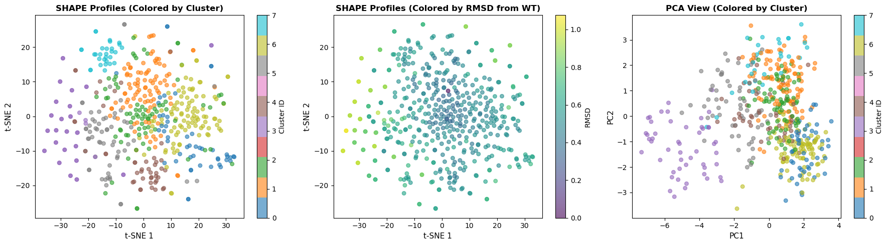

## Part 9: Cluster Characterization

``` python
# Analyze what distinguishes each cluster
cluster_results = []

for cluster_id in range(n_clusters):
    cluster_mask = cluster_labels == cluster_id
    cluster_samples = [samples[i] for i in np.where(cluster_mask)[0]]
    
    # Get annotations
    cluster_annots = [annotations.get(s, 'Unknown') for s in cluster_samples]
    annot_counts = pd.Series(cluster_annots).value_counts()
    
    # Compute mean profile
    cluster_mean_profile = diff_matrix[cluster_mask, :].mean(axis=0)
    
    # Find top differential positions
    abs_profile = np.abs(cluster_mean_profile)
    top_positions_idx = np.argsort(abs_profile)[::-1][:10]
    top_pos_values = [positions[i] for i in top_positions_idx]
    
    cluster_results.append({
        'cluster_id': cluster_id,
        'n_samples': cluster_mask.sum(),
        'top_annotations': annot_counts.head(5).to_dict(),
        'mean_rmsd': rmsd[cluster_mask].mean(),
        'std_rmsd': rmsd[cluster_mask].std(),
        'top_positions': top_pos_values,
        'mean_profile': cluster_mean_profile
    })

# Print cluster summaries
for res in cluster_results:
    print(f"\n{'='*60}")
    print(f"CLUSTER {res['cluster_id']}")
    print(f"{'='*60}")
    print(f"  N samples: {res['n_samples']}")
    print(f"  Mean RMSD: {res['mean_rmsd']:.4f} ± {res['std_rmsd']:.4f}")
    print(f"\n  Top annotations:")
    for annot, count in res['top_annotations'].items():
        print(f"    - {annot}: {count} samples")
    print(f"\n  Top differential positions: {res['top_positions'][:5]}")
```

```         
============================================================
CLUSTER 0
============================================================
  N samples: 49
  Mean RMSD: 0.5693 ± 0.1058

  Top annotations:
    - Can_2_TGF_Can: 8 samples
    - Weaken_Can_Py: 5 samples
    - Swap_C3SS_2_Can: 4 samples
    - C3SS_2_TGF_C3SS: 2 samples
    - Can_2_TGF_C3SS: 2 samples

  Top differential positions: [189, 80, 166, 209, 224]

============================================================
CLUSTER 1
============================================================
  N samples: 94
  Mean RMSD: 0.4676 ± 0.0947

  Top annotations:
    - Branch_Point: 16 samples
    - RBP_Block_Three: 7 samples
    - Strengthen_Can_Py: 6 samples
    - Can_2_TGF_Can: 4 samples
    - NAGNAG: 4 samples

  Top differential positions: [224, 189, 109, 209, 212]

============================================================
CLUSTER 2
============================================================
  N samples: 74
  Mean RMSD: 0.5045 ± 0.0930

  Top annotations:
    - Branch_Point: 8 samples
    - RBP_Block_One: 5 samples
    - Weaken_Can_Py: 4 samples
    - NAGNAG: 4 samples
    - RBP_Block_Two: 3 samples

  Top differential positions: [224, 80, 189, 209, 212]

============================================================
CLUSTER 3
============================================================
  N samples: 50
  Mean RMSD: 0.8612 ± 0.1034

  Top annotations:
    - Dinuc_Shuffle: 9 samples
    - AT_to_GC_20pct_4: 2 samples
    - AT_to_GC_30pct_2: 2 samples
    - AT_to_GC_30pct_4: 2 samples
    - AT_to_GC_30pct_5: 2 samples

  Top differential positions: [80, 109, 102, 166, 69]

============================================================
CLUSTER 4
============================================================
  N samples: 45
  Mean RMSD: 0.5264 ± 0.0683

  Top annotations:
    - Branch_Point: 16 samples
    - Strengthen_C3SS_Py: 4 samples
    - AT_to_GC_10pct_5: 2 samples
    - AT_to_GC_10pct_2: 2 samples
    - GC_to_AT_10pct_2: 2 samples

  Top differential positions: [160, 192, 189, 80, 166]

============================================================
CLUSTER 5
============================================================
  N samples: 60
  Mean RMSD: 0.6274 ± 0.0790

  Top annotations:
    - AT_to_GC_10pct_1: 2 samples
    - AT_to_GC_10pct_3: 2 samples
    - AT_to_GC_20pct_1: 2 samples
    - AT_to_GC_20pct_3: 2 samples
    - AT_to_GC_20pct_5: 2 samples

  Top differential positions: [80, 109, 224, 102, 189]

============================================================
CLUSTER 6
============================================================
  N samples: 95
  Mean RMSD: 0.5169 ± 0.0716

  Top annotations:
    - NAGNAG: 19 samples
    - C3SS_2_TGF_C3SS: 16 samples
    - Weaken_C3SS_Py: 12 samples
    - C3SS_KO: 7 samples
    - RBP_Block_Four: 6 samples

  Top differential positions: [80, 224, 166, 209, 189]

============================================================
CLUSTER 7
============================================================
  N samples: 30
  Mean RMSD: 0.5991 ± 0.0902

  Top annotations:
    - AT_to_GC_50pct_1: 2 samples
    - 16to24_C3SS_Disrupted: 2 samples
    - 16to24_C3SS_Restored: 2 samples
    - AAATTAAAA_to_CCCAGCCCC_Disrupted: 2 samples
    - AAATTAAAA_to_CCCAGCCCC_Restored: 2 samples

  Top differential positions: [69, 224, 79, 62, 189]
```

``` python
# Plot mean profiles for each cluster
fig, axes = plt.subplots(2, 4, figsize=(20, 8), sharex=True, sharey=True)
axes = axes.flatten()

for idx, res in enumerate(cluster_results):
    ax = axes[idx]
    
    # Plot WT baseline
    ax.axhline(0, color='gray', linestyle='--', alpha=0.5, linewidth=1)
    
    # Plot mean cluster profile
    ax.plot(positions, res['mean_profile'], 'b-', linewidth=2, 
           label=f"Cluster {res['cluster_id']}")
    
    # Highlight top differential positions
    top_5_idx = np.argsort(np.abs(res['mean_profile']))[::-1][:5]
    for i in top_5_idx:
        ax.axvline(positions[i], color='r', alpha=0.2, linewidth=1)
    
    ax.set_title(f"Cluster {res['cluster_id']} (n={res['n_samples']})\n" +
                f"RMSD={res['mean_rmsd']:.3f}", fontsize=10, fontweight='bold')
    ax.grid(alpha=0.3)
    ax.legend(fontsize=8)

fig.suptitle('Mean SHAPE Difference Profile by Cluster\n(Red lines = top 5 differential positions)', 
            fontsize=14, fontweight='bold', y=1.00)
fig.text(0.5, 0.02, 'Nucleotide Position', ha='center', fontsize=12)
fig.text(0.02, 0.5, 'ΔReactivity (vs WT)', va='center', rotation='vertical', fontsize=12)
plt.tight_layout()
plt.show()
```

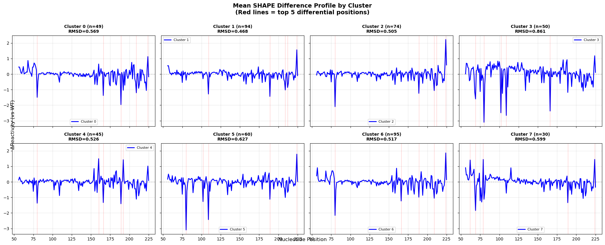

## Part 10: Deep Learning - Autoencoder

``` python
# Define autoencoder
class SHAPEAutoencoder(nn.Module):
    def __init__(self, input_dim, encoding_dim=32):
        super().__init__()
        
        # Encoder
        self.encoder = nn.Sequential(
            nn.Linear(input_dim, 128),
            nn.ReLU(),
            nn.Dropout(0.2),
            nn.Linear(128, 64),
            nn.ReLU(),
            nn.Dropout(0.2),
            nn.Linear(64, encoding_dim),
        )
        
        # Decoder
        self.decoder = nn.Sequential(
            nn.Linear(encoding_dim, 64),
            nn.ReLU(),
            nn.Dropout(0.2),
            nn.Linear(64, 128),
            nn.ReLU(),
            nn.Dropout(0.2),
            nn.Linear(128, input_dim),
        )
    
    def forward(self, x):
        encoded = self.encoder(x)
        decoded = self.decoder(encoded)
        return decoded
    
    def encode(self, x):
        return self.encoder(x)

print("✓ Autoencoder model defined")
```

```         
✓ Autoencoder model defined
```

``` python
# Prepare data for autoencoder
device = torch.device('cuda' if torch.cuda.is_available() else 'cpu')
print(f"Using device: {device}")

# Convert to tensors
X_train = torch.FloatTensor(diff_matrix).to(device)

# Initialize model
input_dim = diff_matrix.shape[1]
encoding_dim = 32

autoencoder = SHAPEAutoencoder(input_dim, encoding_dim).to(device)
print(f"\nModel architecture:")
print(autoencoder)

# Count parameters
n_params = sum(p.numel() for p in autoencoder.parameters())
print(f"\nTotal parameters: {n_params:,}")
```

```         
Using device: cuda

Model architecture:
SHAPEAutoencoder(
  (encoder): Sequential(
    (0): Linear(in_features=170, out_features=128, bias=True)
    (1): ReLU()
    (2): Dropout(p=0.2, inplace=False)
    (3): Linear(in_features=128, out_features=64, bias=True)
    (4): ReLU()
    (5): Dropout(p=0.2, inplace=False)
    (6): Linear(in_features=64, out_features=32, bias=True)
  )
  (decoder): Sequential(
    (0): Linear(in_features=32, out_features=64, bias=True)
    (1): ReLU()
    (2): Dropout(p=0.2, inplace=False)
    (3): Linear(in_features=64, out_features=128, bias=True)
    (4): ReLU()
    (5): Dropout(p=0.2, inplace=False)
    (6): Linear(in_features=128, out_features=170, bias=True)
  )
)

Total parameters: 64,586
```

``` python
torch.set_num_threads(8)
#torch.set_num_interop_threads(10)
#autoencoder = torch.compile(SHAPEAutoencoder)

# Train autoencoder
criterion = nn.MSELoss()
optimizer = torch.optim.Adam(autoencoder.parameters(), lr=0.001)

epochs = 100
batch_size = 256

print(f"Training autoencoder for {epochs} epochs...\n")

losses = []
autoencoder.train()

for epoch in range(epochs):
    # Mini-batch training
    epoch_loss = 0
    n_batches = 0
    
    for i in range(0, len(X_train), batch_size):
        batch = X_train[i:i+batch_size]
        
        # Forward pass
        reconstructed = autoencoder(batch)
        loss = criterion(reconstructed, batch)
        
        # Backward pass
        optimizer.zero_grad()
        loss.backward()
        optimizer.step()
        
        epoch_loss += loss.item()
        n_batches += 1
    
    avg_loss = epoch_loss / n_batches
    losses.append(avg_loss)
    
    if (epoch + 1) % 10 == 0:
        print(f"Epoch {epoch+1}/{epochs}, Loss: {avg_loss:.6f}")

print("\n✓ Training complete!")
```

```         
Training autoencoder for 100 epochs...

Epoch 10/100, Loss: 0.245783
Epoch 20/100, Loss: 0.222021
Epoch 30/100, Loss: 0.204496
Epoch 40/100, Loss: 0.199501
Epoch 50/100, Loss: 0.191206
Epoch 60/100, Loss: 0.183472
Epoch 70/100, Loss: 0.175846
Epoch 80/100, Loss: 0.169715
Epoch 90/100, Loss: 0.164333
Epoch 100/100, Loss: 0.159416

✓ Training complete!
```

``` python
# Plot training loss
fig, ax = plt.subplots(figsize=(10, 5))
ax.plot(losses, 'b-', linewidth=2)
ax.set_xlabel('Epoch', fontsize=12)
ax.set_ylabel('MSE Loss', fontsize=12)
ax.set_title('Autoencoder Training Loss', fontsize=14, fontweight='bold')
ax.grid(alpha=0.3)
plt.tight_layout()
plt.show()
```

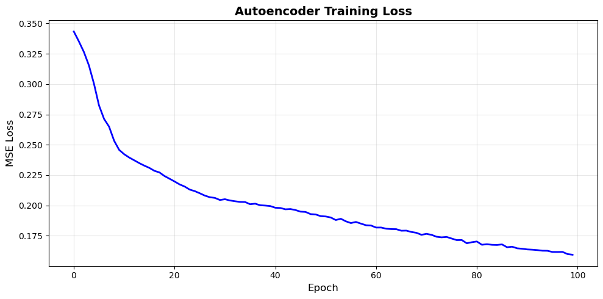

``` python
# Get encodings
autoencoder.eval()
with torch.no_grad():
    encodings = autoencoder.encode(X_train).cpu().numpy()

print(f"Encoded representation shape: {encodings.shape}")
print(f"Original shape: {diff_matrix.shape}")
print(f"Compression ratio: {diff_matrix.shape[1] / encodings.shape[1]:.1f}x")
```

```         
Encoded representation shape: (497, 32)
Original shape: (497, 170)
Compression ratio: 5.3x
```

``` python
# Visualize encoded space
if umap:
    reducer_ae = umap.UMAP(n_neighbors=15, min_dist=0.1, random_state=42)
    embedding_ae = reducer_ae.fit_transform(encodings)
else:
    tsne_ae = TSNE(n_components=2, random_state=42, perplexity=30)
    embedding_ae = tsne_ae.fit_transform(encodings)

fig, axes = plt.subplots(1, 2, figsize=(14, 5))

# Plot 1: Original space
ax = axes[0]
scatter = ax.scatter(embedding[:, 0], embedding[:, 1], 
                    c=cluster_labels, cmap='tab10', s=30, alpha=0.6)
ax.set_xlabel(f'{embedding_method} 1', fontsize=11)
ax.set_ylabel(f'{embedding_method} 2', fontsize=11)
ax.set_title('Original SHAPE Space', fontsize=12, fontweight='bold')
plt.colorbar(scatter, ax=ax, label='Cluster')

# Plot 2: Encoded space
ax = axes[1]
scatter = ax.scatter(embedding_ae[:, 0], embedding_ae[:, 1], 
                    c=cluster_labels, cmap='tab10', s=30, alpha=0.6)
ax.set_xlabel(f'{embedding_method} 1', fontsize=11)
ax.set_ylabel(f'{embedding_method} 2', fontsize=11)
ax.set_title('Autoencoder Latent Space', fontsize=12, fontweight='bold')
plt.colorbar(scatter, ax=ax, label='Cluster')

plt.tight_layout()
plt.show()
```

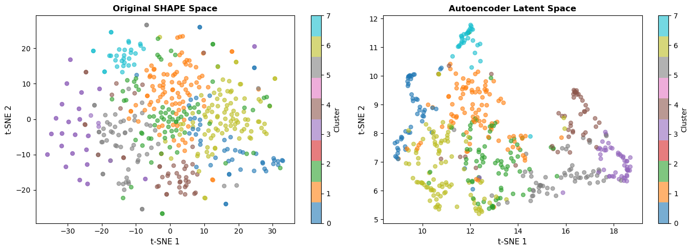

## Part 11: Deep Learning - Attention Model

``` python
# Define attention-based classifier
class SHAPEAttentionClassifier(nn.Module):
    """
    Attention model that learns which positions are most important
    for predicting annotation categories
    """
    def __init__(self, input_dim, n_classes, hidden_dim=64):
        super().__init__()
        
        self.input_dim = input_dim
        
        # Position-wise transformation
        self.position_transform = nn.Sequential(
            nn.Linear(1, hidden_dim),
            nn.ReLU()
        )
        
        # Attention mechanism
        self.attention = nn.Sequential(
            nn.Linear(hidden_dim, 32),
            nn.Tanh(),
            nn.Linear(32, 1)
        )
        
        # Classifier
        self.classifier = nn.Sequential(
            nn.Linear(hidden_dim, 64),
            nn.ReLU(),
            nn.Dropout(0.3),
            nn.Linear(64, 32),
            nn.ReLU(),
            nn.Dropout(0.3),
            nn.Linear(32, n_classes)
        )
    
    def forward(self, x):
        # x shape: (batch, input_dim)
        batch_size = x.shape[0]
        
        # Transform each position
        x_reshaped = x.unsqueeze(-1)  # (batch, input_dim, 1)
        position_features = self.position_transform(x_reshaped)  # (batch, input_dim, hidden_dim)
        
        # Compute attention weights
        attention_scores = self.attention(position_features).squeeze(-1)  # (batch, input_dim)
        attention_weights = F.softmax(attention_scores, dim=1)  # (batch, input_dim)
        
        # Apply attention
        weighted_features = (position_features * attention_weights.unsqueeze(-1)).sum(dim=1)  # (batch, hidden_dim)
        
        # Classify
        output = self.classifier(weighted_features)
        
        return output, attention_weights

print("✓ Attention model defined")
```

```         
✓ Attention model defined
```

``` python
# Prepare labels for classification
# Use top 10 most common annotations
top_n_annots = 10
annot_series = pd.Series([annotations.get(s, 'Unknown') for s in samples])
top_annots_list = annot_series.value_counts().head(top_n_annots).index.tolist()

# Filter to only samples with these annotations
mask = annot_series.isin(top_annots_list)
filtered_indices = np.where(mask)[0]

X_filtered = diff_matrix[filtered_indices, :]
y_annots = annot_series[mask].values

# Create label mapping
label_map = {annot: i for i, annot in enumerate(top_annots_list)}
y_labels = np.array([label_map[a] for a in y_annots])

print(f"Filtered dataset:")
print(f"  Samples: {len(X_filtered)}")
print(f"  Classes: {len(top_annots_list)}")
print(f"\nClass distribution:")
for annot in top_annots_list:
    count = (y_annots == annot).sum()
    print(f"  {annot}: {count} samples")
```

```         
Filtered dataset:
  Samples: 172
  Classes: 10

Class distribution:
  Branch_Point: 46 samples
  NAGNAG: 30 samples
  C3SS_2_TGF_C3SS: 22 samples
  Can_2_TGF_Can: 14 samples
  Weaken_C3SS_Py: 12 samples
  Weaken_Can_Py: 12 samples
  Dinuc_Shuffle: 10 samples
  Move_C3SS: 10 samples
  RBP_Block_Four: 8 samples
  RBP_Block_Three: 8 samples
```

``` python
# Split data
from sklearn.model_selection import train_test_split

X_train_clf, X_test_clf, y_train_clf, y_test_clf = train_test_split(
    X_filtered, y_labels, test_size=0.2, random_state=42, stratify=y_labels
)

# Convert to tensors
X_train_t = torch.FloatTensor(X_train_clf).to(device)
X_test_t = torch.FloatTensor(X_test_clf).to(device)
y_train_t = torch.LongTensor(y_train_clf).to(device)
y_test_t = torch.LongTensor(y_test_clf).to(device)

print(f"Training set: {len(X_train_t)} samples")
print(f"Test set: {len(X_test_t)} samples")
```

```         
Training set: 137 samples
Test set: 35 samples
```

``` python
# Initialize attention model
n_classes = len(top_annots_list)
attention_model = SHAPEAttentionClassifier(input_dim, n_classes, hidden_dim=64).to(device)

print("Attention model:")
print(attention_model)

n_params_att = sum(p.numel() for p in attention_model.parameters())
print(f"\nTotal parameters: {n_params_att:,}")
```

```         
Attention model:
SHAPEAttentionClassifier(
  (position_transform): Sequential(
    (0): Linear(in_features=1, out_features=64, bias=True)
    (1): ReLU()
  )
  (attention): Sequential(
    (0): Linear(in_features=64, out_features=32, bias=True)
    (1): Tanh()
    (2): Linear(in_features=32, out_features=1, bias=True)
  )
  (classifier): Sequential(
    (0): Linear(in_features=64, out_features=64, bias=True)
    (1): ReLU()
    (2): Dropout(p=0.3, inplace=False)
    (3): Linear(in_features=64, out_features=32, bias=True)
    (4): ReLU()
    (5): Dropout(p=0.3, inplace=False)
    (6): Linear(in_features=32, out_features=10, bias=True)
  )
)

Total parameters: 8,811
```

``` python
# Train attention model
criterion_clf = nn.CrossEntropyLoss()
optimizer_clf = torch.optim.Adam(attention_model.parameters(), lr=0.001)

epochs_clf = 50
batch_size_clf = 16

print(f"Training attention classifier for {epochs_clf} epochs...\n")

train_losses = []
train_accs = []
test_accs = []

for epoch in range(epochs_clf):
    attention_model.train()
    epoch_loss = 0
    correct = 0
    total = 0
    
    # Training
    for i in range(0, len(X_train_t), batch_size_clf):
        batch_x = X_train_t[i:i+batch_size_clf]
        batch_y = y_train_t[i:i+batch_size_clf]
        
        # Forward
        outputs, _ = attention_model(batch_x)
        loss = criterion_clf(outputs, batch_y)
        
        # Backward
        optimizer_clf.zero_grad()
        loss.backward()
        optimizer_clf.step()
        
        epoch_loss += loss.item()
        
        # Accuracy
        _, predicted = outputs.max(1)
        total += batch_y.size(0)
        correct += predicted.eq(batch_y).sum().item()
    
    train_acc = 100. * correct / total
    avg_loss = epoch_loss / (len(X_train_t) // batch_size_clf + 1)
    
    # Evaluation
    attention_model.eval()
    with torch.no_grad():
        outputs_test, _ = attention_model(X_test_t)
        _, predicted_test = outputs_test.max(1)
        test_acc = 100. * predicted_test.eq(y_test_t).sum().item() / len(y_test_t)
    
    train_losses.append(avg_loss)
    train_accs.append(train_acc)
    test_accs.append(test_acc)
    
    if (epoch + 1) % 10 == 0:
        print(f"Epoch {epoch+1}/{epochs_clf}")
        print(f"  Loss: {avg_loss:.4f}")
        print(f"  Train Acc: {train_acc:.2f}%")
        print(f"  Test Acc: {test_acc:.2f}%")

print("\n✓ Training complete!")
```

```         
Training attention classifier for 50 epochs...

Epoch 10/50
  Loss: 2.1329
  Train Acc: 27.01%
  Test Acc: 25.71%
Epoch 20/50
  Loss: 2.1211
  Train Acc: 27.01%
  Test Acc: 25.71%
Epoch 30/50
  Loss: 2.0357
  Train Acc: 27.74%
  Test Acc: 25.71%
Epoch 40/50
  Loss: 1.9857
  Train Acc: 30.66%
  Test Acc: 28.57%
Epoch 50/50
  Loss: 1.8925
  Train Acc: 29.93%
  Test Acc: 31.43%

✓ Training complete!
```

``` python
# Plot training metrics
fig, axes = plt.subplots(1, 2, figsize=(14, 5))

# Loss
ax = axes[0]
ax.plot(train_losses, 'b-', linewidth=2, label='Training Loss')
ax.set_xlabel('Epoch', fontsize=11)
ax.set_ylabel('Loss', fontsize=11)
ax.set_title('Classification Loss', fontsize=12, fontweight='bold')
ax.legend()
ax.grid(alpha=0.3)

# Accuracy
ax = axes[1]
ax.plot(train_accs, 'b-', linewidth=2, label='Train Accuracy')
ax.plot(test_accs, 'r-', linewidth=2, label='Test Accuracy')
ax.set_xlabel('Epoch', fontsize=11)
ax.set_ylabel('Accuracy (%)', fontsize=11)
ax.set_title('Classification Accuracy', fontsize=12, fontweight='bold')
ax.legend()
ax.grid(alpha=0.3)

plt.tight_layout()
plt.show()

print(f"Final test accuracy: {test_accs[-1]:.2f}%")
```

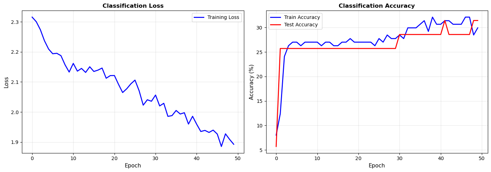

```         
Final test accuracy: 31.43%
```

## Part 12: Attention Visualization - Important Positions

``` python
# Extract attention weights for all samples
attention_model.eval()
with torch.no_grad():
    X_all_t = torch.FloatTensor(X_filtered).to(device)
    _, attention_weights_all = attention_model(X_all_t)
    attention_weights_np = attention_weights_all.cpu().numpy()

print(f"Attention weights shape: {attention_weights_np.shape}")
```

```         
Attention weights shape: (172, 170)
```

``` python
# Plot average attention by class
fig, ax = plt.subplots(figsize=(14, 6))

for class_idx, annot in enumerate(top_annots_list[:5]):  # Top 5 classes
    class_mask = y_labels == class_idx
    mean_attention = attention_weights_np[class_mask, :].mean(axis=0)
    
    ax.plot(positions, mean_attention, linewidth=2, label=annot, alpha=0.7)

ax.set_xlabel('Nucleotide Position', fontsize=12)
ax.set_ylabel('Mean Attention Weight', fontsize=12)
ax.set_title('Average Attention by Annotation Class\n(Shows which positions are most important for each class)', 
            fontsize=13, fontweight='bold')
ax.legend(bbox_to_anchor=(1.05, 1), loc='upper left', fontsize=9)
ax.grid(alpha=0.3)
plt.tight_layout()
plt.show()
```

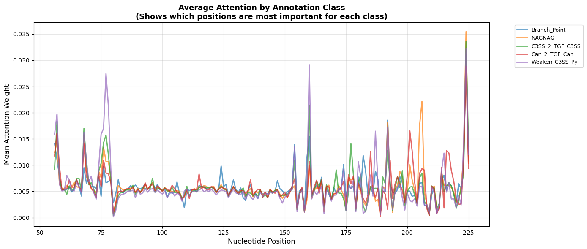

``` python
# Find most important positions overall
mean_attention_overall = attention_weights_np.mean(axis=0)
top_attention_idx = np.argsort(mean_attention_overall)[::-1][:20]
top_attention_positions = [positions[i] for i in top_attention_idx]
top_attention_weights = mean_attention_overall[top_attention_idx]

print("\nTop 20 most important positions (by attention):")
for pos, weight in zip(top_attention_positions, top_attention_weights):
    print(f"  Position {pos}: {weight:.6f}")
```

```         
Top 20 most important positions (by attention):
  Position 224: 0.032600
  Position 57: 0.014584
  Position 160: 0.013639
  Position 192: 0.012655
  Position 68: 0.012181
  Position 56: 0.012073
  Position 76: 0.011137
  Position 154: 0.010530
  Position 77: 0.010120
  Position 225: 0.010068
  Position 223: 0.009949
  Position 206: 0.009796
  Position 180: 0.009512
  Position 205: 0.009221
  Position 78: 0.009141
  Position 74: 0.008590
  Position 214: 0.008356
  Position 69: 0.008346
  Position 197: 0.008092
  Position 124: 0.007748
```

``` python
# Heatmap of attention weights
fig, ax = plt.subplots(figsize=(14, 8))

# Sample 50 random samples for visualization
sample_idx = np.random.choice(len(attention_weights_np), size=min(50, len(attention_weights_np)), replace=False)
attention_sample = attention_weights_np[sample_idx, :]

im = ax.imshow(attention_sample, aspect='auto', cmap='YlOrRd')
ax.set_xlabel('Nucleotide Position', fontsize=11)
ax.set_ylabel('Sample', fontsize=11)
ax.set_title(f'Attention Heatmap ({len(sample_idx)} samples)\nBrighter = More Important', 
            fontsize=13, fontweight='bold')
plt.colorbar(im, ax=ax, label='Attention Weight')
plt.tight_layout()
plt.show()
```

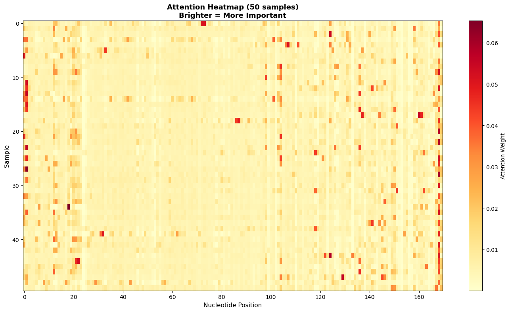

## Part 13: Summary and Export Results

``` python
# Create comprehensive results dataframe
final_results = pd.DataFrame({
    'sample': samples,
    'annotation': [annotations.get(s, 'Unknown') for s in samples],
    'rmsd_from_wt': rmsd,
    'mean_abs_diff': mean_abs_diff,
    'max_abs_diff': max_abs_diff,
    'cluster': cluster_labels,
    'embedding_1': embedding[:, 0],
    'embedding_2': embedding[:, 1],
    'pc1': X_pca[:, 0],
    'pc2': X_pca[:, 1]
})

# Add encoding features
for i in range(encoding_dim):
    final_results[f'encoding_{i}'] = encodings[:, i]

final_results.head()
```

<div>

```{=html}
<style scoped>
    .dataframe tbody tr th:only-of-type {
        vertical-align: middle;
    }

    .dataframe tbody tr th {
        vertical-align: top;
    }

    .dataframe thead th {
        text-align: right;
    }
</style>
```

</div>

``` python
# Save results
final_results.to_csv('SHAPE_analysis_results.csv', index=False)
print("✓ Results saved to 'SHAPE_analysis_results.csv'")

# Save cluster info
cluster_info = []
for res in cluster_results:
    cluster_info.append({
        'cluster_id': res['cluster_id'],
        'n_samples': res['n_samples'],
        'mean_rmsd': res['mean_rmsd'],
        'std_rmsd': res['std_rmsd'],
        'top_annotation': list(res['top_annotations'].keys())[0] if res['top_annotations'] else 'None'
    })

cluster_df = pd.DataFrame(cluster_info)
cluster_df.to_csv('cluster_summary.csv', index=False)
print("✓ Cluster summary saved to 'cluster_summary.csv'")
```

```         
✓ Results saved to 'SHAPE_analysis_results.csv'
✓ Cluster summary saved to 'cluster_summary.csv'
```

# Save models

torch.save(autoencoder.state_dict(), 'autoencoder_model.pt') torch.save(attention_model.state_dict(), 'attention_model.pt') print("✓ Models saved to .pt files")

print("\n" + "="*60) print("ANALYSIS COMPLETE!") print("="*60) print("\nGenerated files:") print(" - SHAPE_analysis_results.csv") print(" - cluster_summary.csv") print(" - autoencoder_model.pt") print(" - attention_model.pt")
